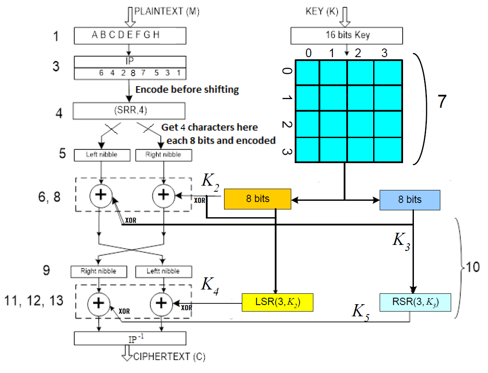
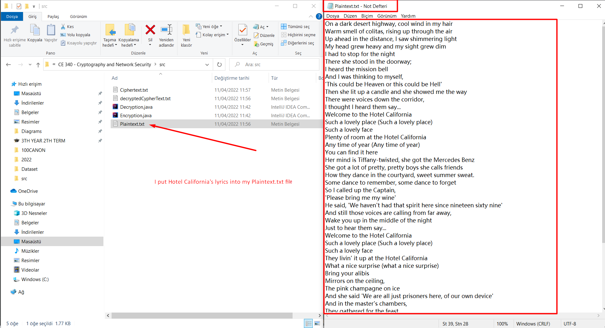
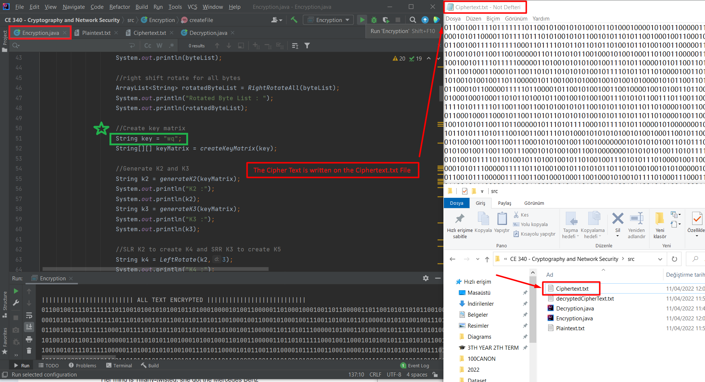
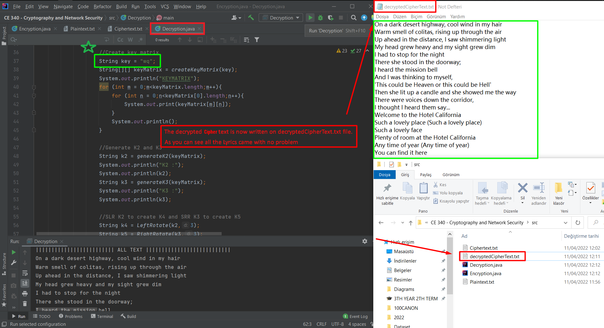

# Feistel-Ciphering
1) Your code will read a plaintext from a file block-by-block with block size of 8 characters. Please note that plaintext file must contain at least 10 lines of text with each line minimum 25 characters.
2) A permutation code of length 8 is chosen to be IP = 6 4 2 8 7 5 3 1. The 8-character text blocks will be permutated using the initial permutation (IP) code.
3) Use either BINARY values of characters from Table 1("A" = 00000001, "B" = 00000010, ... , "Z" = 00011101, "." = 00011110) to encode characters so that each character will be 8 bits of length.
4) Preform a Shift-right-rotate operation with 4 positions on the encoded characters.
5) Get 2 characters at a time from the encoded block: Characters at odd positions are placed into the left nibble and characters with even positions are placed into the right nibble.
6) Choose a 16-bit (2 characters) key and convert them to 16 bits, and put the bits into a 4x4 matrix (table), see Fig.1.
7) Now use the columns 3,1,0, 2 to generate K2 and use columns 0,1,3,2 to generate K3.
 a. Concatenate columns 3 and 1, that is x = (3||1), and concatenate columns 0 and 2 that is y = (0||2). Here, x and y will now be 8 bits each. Now perform XOR on x and y to generate K2, i.e., K2 = (x XOR y)
 b. Concatenate columns 0 and 1, that is w = (0||1), and concatenate columns 2 and 3, that is z = (2||3), and. Now perform XOR on x and y to generate, i.e., K3 = (w XOR z).
 c. Use K2 in function SLR(3, K2) to generate K4. Likewise, Use K3 in function SRR(3, K3) to generate K5.
8) Apply XOR together with K2 and K3 to encrypt the first part (stage 6, 8). Swap XOR’d partitions so that left becomes right and right becomes left.
9) Now, generate two new sub-keys (K4 and K5) by using K2 and K3 and the two rotate functions, see Fig.1 (part 10).
10) The swapped partitions are XOR’d with the new sub-keys.
11) Swap the result again and merge the results of swapping.
12) Finally, a cipher block is obtained by passing the resulting 8-character block through the reverse permutation.
13) Encrypted blocks will be saved in a ciphertext file.
14) Finally, verify your encryption by decrypting the ciphertext file.

# Sample Run Examples

